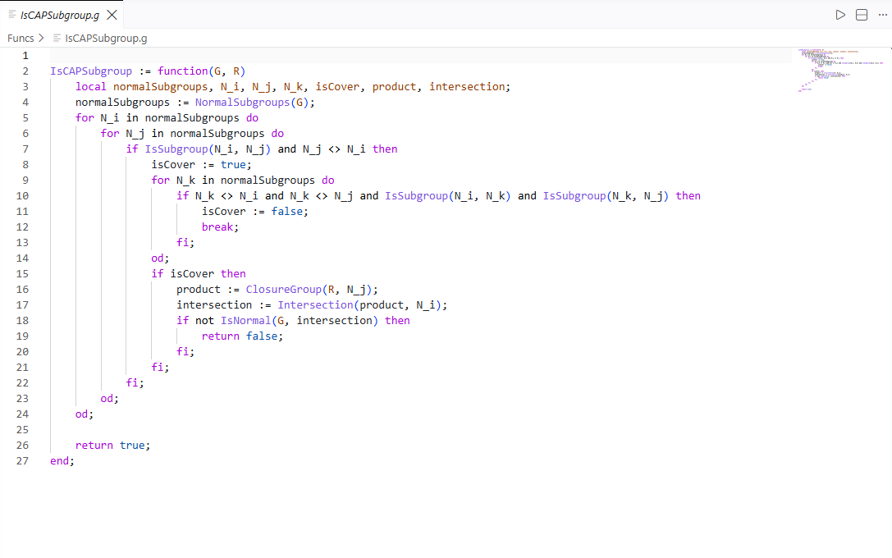
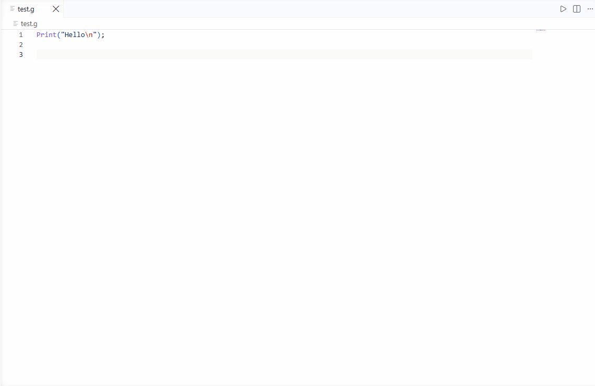
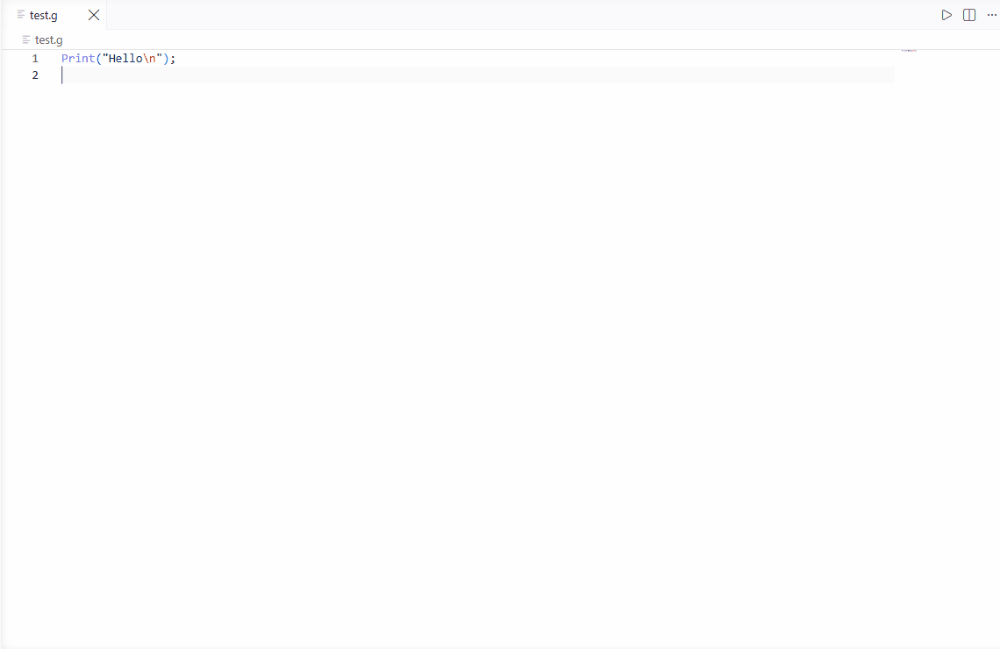

# GAP System Support

[](LICENSE)

English | [简体中文](README.zh-cn.md)

Syntax highlighting, code completion and running for GAP code in VS Code, powered by [tree-sitter-gap](https://github.com/gap-system/tree-sitter-gap), so that GAP users can write, read and run GAP code more conveniently in VS Code.

> GAP is a system for computational discrete algebra, with particular emphasis on Computational Group Theory. GAP provides a programming language, a library of thousands of functions implementing algebraic algorithms written in the GAP language as well as large data libraries of algebraic objects. For more information, see the [GAP official website](https://www.gap-system.org/).

## Feature Demos

### Syntax Highlighting

Semantic highlighting based on `tree-sitter-gap`.



### Code Completion

Completion for GAP constants, keywords, statement structures and GAP functions while typing.



### Running GAP

#### Run a File

Run the current GAP file in a VS Code terminal with the run button at the top right of the editor.



#### Configure Command Line Options

Configure GAP command line options through Quick Pick.


#### Notes

There are two things to note when running a GAP file:

1. The `gap` command must be executable in the terminal.
2. When running a GAP file, the terminal cwd comes from `vscode.workspace.getWorkspaceFolder(doc.uri)`. This function returns the workspace folder that contains the given uri, or `undefined` when the uri doesn't match any workspace folder. In that case the terminal is created without a cwd and starts in the user home directory. See the [VS Code API](https://code.visualstudio.com/api/references/vscode-api#workspace.getWorkspaceFolder) for details.

The following shows how to add GAP (installed via the `.exe` installer) to the system PATH on Windows. Run in PowerShell (replace the paths with your actual installation paths):

```powershell
$userPath = [Environment]::GetEnvironmentVariable('PATH', 'User')
[Environment]::SetEnvironmentVariable('PATH', $userPath + ';C:\Program Files\GAP-4.16.0\runtime\opt\gap-4.16.0;C:\Program Files\GAP-4.16.0\runtime\bin', 'User')
```

Restart PowerShell and run `gap --version` to confirm it works.

## Settings

| Setting | Default | Description |
|---|---|---|
| `gap.runMode` | `reuse` | Terminal mode: `new` opens a new terminal for each run, `reuse` reuses the same GAP terminal |
| `gap.terminalRoot` | (empty) | Unix root for Windows drive letters. Example: `/` turns `C:\project\file.g` into `/c/project/file.g`. Leave empty to use WSL default `/mnt/` |

## Commands

Press `Ctrl+Shift+P` to open the command palette and use the following commands:

| Command | Description |
|---|---|
| `GAP: Run GAP File` | Run the current GAP file in a terminal |
| `GAP: Configure GAP Command Line Options` | Configure GAP command line options through Quick Pick |
| `GAP: Generate Completion Data` | Generate completion data with a local GAP |
| `GAP: Reset Completion Data` | Restore the default completion data |

## Development

First install dependencies and compile the TypeScript sources:

```bash
npm install
npm run compile
```

Run the tests:

```bash
npm test
```

Then press `F5` to launch debugging.

## Acknowledgements

- Syntax highlighting is implemented based on the [tree-sitter-gap](https://github.com/gap-system/tree-sitter-gap) query files.
- The extension icon is from [gap-logo](https://github.com/gap-system/gap-logo).

## Third Party Notices

- The query files and grammar rules are from [tree-sitter-gap](https://github.com/gap-system/tree-sitter-gap) (MIT, Copyright (c) 2019 Max Horn, contributor Reinis Cirpons).
- The GAP logo is © Max Horn (contributor Reinis Cirpons) and a trademark of the GAP project, licensed under [CC BY-SA 4.0](https://creativecommons.org/licenses/by-sa/4.0/). Derivatives must be shared under the same license. See [gap-logo](https://github.com/gap-system/gap-logo).
- See [THIRDPARTYNOTICES.md](THIRDPARTYNOTICES.md) for third-party notices.

## License

[MIT](LICENSE)