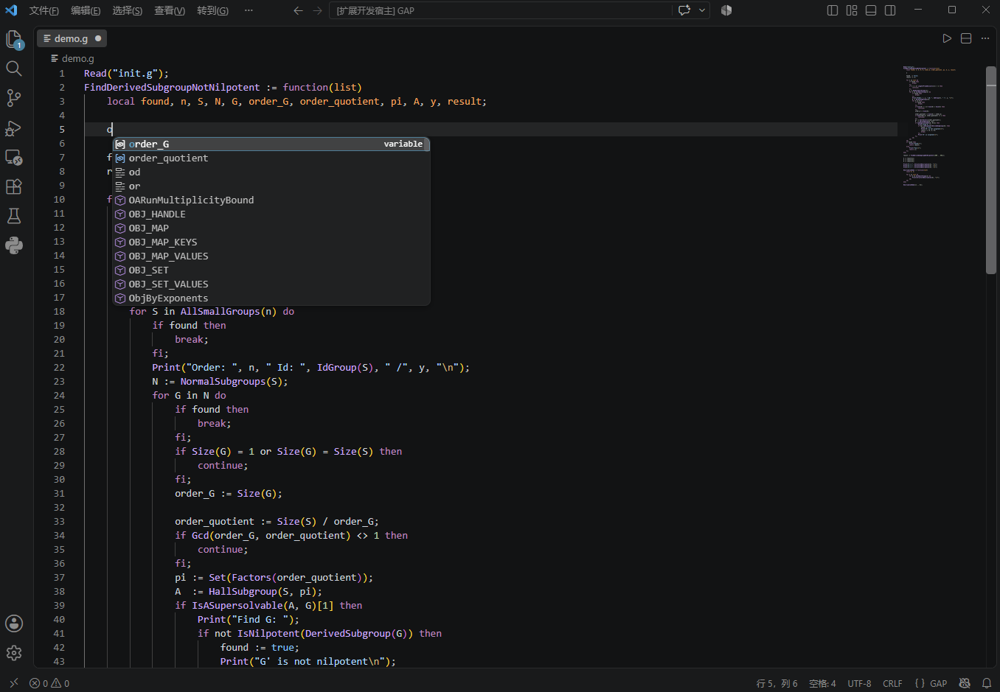
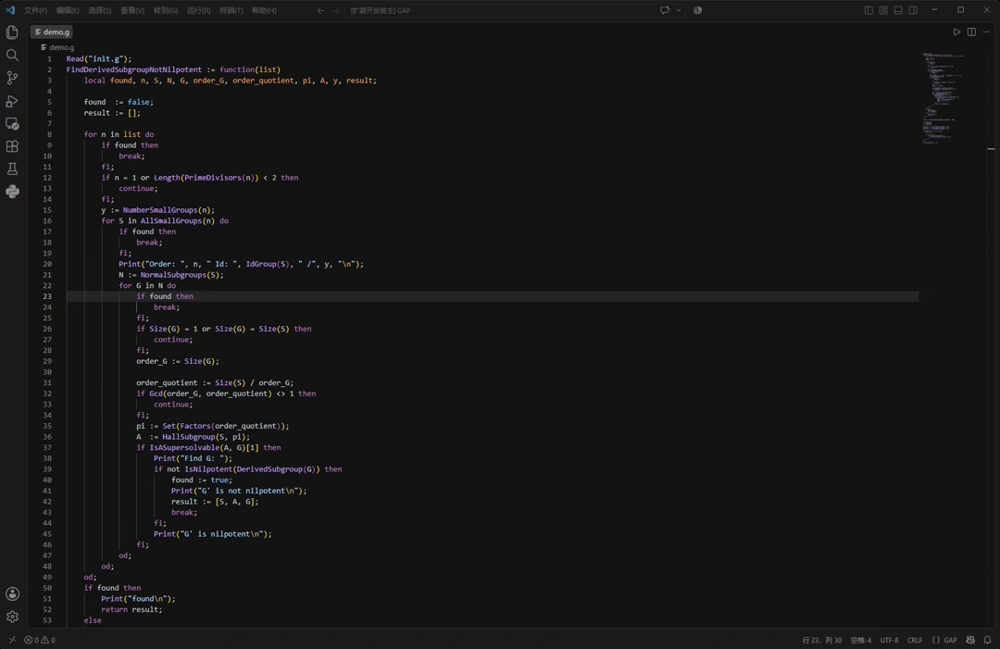
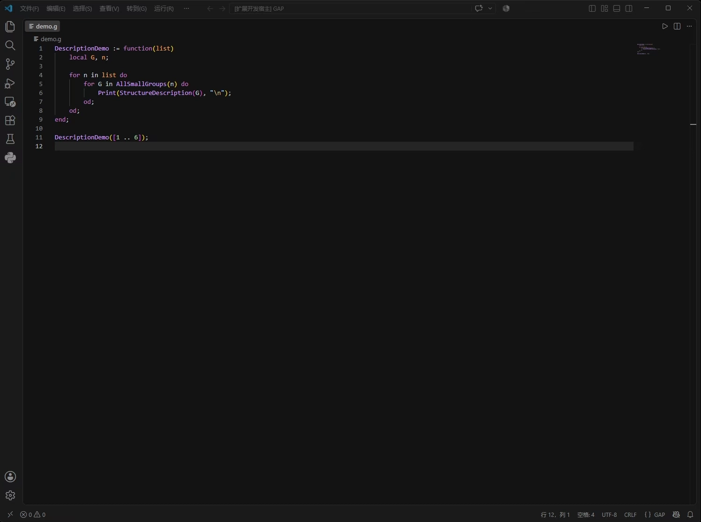

# GAP System Support

[](LICENSE)

[English](README.md) | 简体中文

在 VS Code 中为 GAP 代码提供基于 [tree-sitter-gap](https://github.com/gap-system/tree-sitter-gap) 的语义高亮、代码补全、语法诊断、悬停提示、代码折叠、GAP 文件运行和帮助系统，让 GAP 用户在 VS Code 中便捷地编写、阅读和运行 GAP 代码，并随时查询 GAP 帮助文档。扩展可识别的 GAP 文件扩展名为：`.g`、`.gi`、`.gd`、`.gap`。

> GAP 是一个面向计算离散代数的系统，尤其侧重于计算群论。它提供了一门编程语言和数千个用该语言编写的代数算法函数，并附带大型代数对象数据库。更多信息可见 [GAP 官方网站](https://www.gap-system.org/)。

## 快速开始

### 1. 安装 GAP 并配置 PATH

先确认 GAP 已经安装成功并且已经添加到系统 `PATH`。如果未添加到 `PATH`，则可以参考下面的步骤进行配置。

**Windows**：如果 GAP 是通过 `.exe` 安装器安装的，则可以在 PowerShell 中执行：

```powershell
$userPath = [Environment]::GetEnvironmentVariable('PATH', 'User')
[Environment]::SetEnvironmentVariable('PATH', $userPath + ';C:\Program Files\GAP-4.16.0\runtime\opt\gap-4.16.0;C:\Program Files\GAP-4.16.0\runtime\bin', 'User')
```

执行完上述命令后，重新打开一个 PowerShell 终端，运行 `gap --version`，如果能正常输出 GAP 版本号，说明环境已配置成功。

**Linux / macOS**：在终端运行以下命令（macOS 请将 `~/.bashrc` 换成 `~/.zshrc`）：

```bash
echo 'export PATH="/opt/gap-4.16.0:$PATH"' >> ~/.bashrc
source ~/.bashrc
```

最后运行 `gap --version` 验证。

**注意**：如果安装路径与示例不同，请替换为实际安装路径。

### 2. 在扩展设置中配置 GAP 文档路径

在欢迎页面的入门引导（walkthrough）或 VS Code 的扩展设置中填写以下设置项：

- `gap.docPath`：`doc/` 文件夹的绝对路径，例如：
  - Windows: `C:\Program Files\GAP-4.16.0\runtime\opt\gap-4.16.0\doc`
  - Linux/macOS: `/opt/gap-4.16.0/doc`
- `gap.pkgPath`：`pkg/` 文件夹的绝对路径，例如：
  - Windows: `C:\Program Files\GAP-4.16.0\runtime\opt\gap-4.16.0\pkg`
  - Linux/macOS: `/opt/gap-4.16.0/pkg`

## 主要功能说明

- **语义高亮**：基于 `tree-sitter-gap`。
- **代码折叠**：按语法结构（例如 `if ... fi`、`function ... end`）提供折叠范围。
- **语法诊断**：在问题面板中实时报告语法错误（缺失语法、意外语法）。
- **悬停提示**：将鼠标悬停在函数名上时，GAP 函数会显示帮助链接；自定义函数则显示定义行和 `##` 注释，并支持跳转到定义（包括通过 `Read` 加载的文件）。
- **代码补全**：支持 GAP 常量、关键字、语句结构和 GAP 函数，同时根据光标位置补全当前上下文可用的变量和自定义函数（包括通过 `Read` 加载的其他 GAP 文件中的函数）。
- **运行 GAP 代码**：在 VS Code 集成终端中运行当前 GAP 文件，并支持配置 GAP 命令行选项和终端复用方式。
- **帮助系统**：内置 GAP 帮助搜索，支持两种搜索模式（可在设置或 Quick Pick 搜索框中随时切换），并可按书籍（books）过滤结果。
  - **prefix**：对应 GAP 中的 `?topic`
  - **substring**：对应 GAP 中的 `??topic`
- **帮助文档浏览**：搜索结果会在 Webview 面板中展示，并支持链接导航（含页内锚点跳转）、MathJax 数学公式渲染以及深浅色文档外观。

## 功能演示

### 1. 语法高亮、代码补全



### 2. 帮助查询系统



### 3. GAP 运行及命令行选项配置



> 说明：运行 GAP 文件时，终端的 cwd 通过 `vscode.workspace.getWorkspaceFolder(doc.uri)` 函数获取。
> 对于单根工作区，cwd 会被设置为工作区根目录；
> 对于多根工作区，cwd 会被设置为包含该 GAP 文件的工作区根目录（嵌套根则返回最深层的根目录）；
> 如果 GAP 文件不在任何工作区中，则不指定 cwd，终端使用 VS Code 默认目录。
> 更多信息可见 [VS Code API](https://code.visualstudio.com/api/references/vscode-api#workspace.getWorkspaceFolder)。

## 设置项

| 设置项 | 默认值 | 说明 |
|---|---|---|
| `gap.docPath` | `""` | 手动填写 `doc/` 目录绝对路径 |
| `gap.pkgPath` | `""` | 手动填写 `pkg/` 目录绝对路径 |
| `gap.docAppearance` | `system` | 文档外观，`system` 跟随 VS Code 主题，`dark` / `light` 使用深色或浅色主题 |
| `gap.mathJax` | `true` | 是否在 GAP 文档页面中渲染 MathJax 数学公式 |
| `gap.runMode` | `reuse` | 运行 GAP 时，`reuse` 复用同一个终端，`new` 每次新建终端 |
| `gap.terminalRoot` | `""` | Windows 盘符对应的 Unix 根目录。示例：`/` 会把 `C:\project\file.g` 转成 `/c/project/file.g`；留空时 WSL 默认使用 `/mnt/` |
| `gap.searchMode` | `prefix` | 搜索模式，`prefix` 对应 `?topic`，`substring` 对应 `??topic` |
| `gap.diagnostics` | `true` | 在问题面板显示 GAP 解析器产生的语法错误诊断 |

## 命令

按 `Ctrl+Shift+P` 或 `F1` 打开命令面板，即可使用以下命令：

| 命令 | 说明 |
|---|---|
| `GAP: Run GAP File` | 当打开 GAP 文件时可用，在终端中运行当前 GAP 文件 |
| `GAP: Configure GAP Command Line Options` | 通过 Quick Pick 配置 GAP 命令行选项 |
| `GAP: Search GAP Help` | 搜索 GAP 帮助文档 |
| `GAP: Rebuild Help Index` | 重新生成帮助索引 |
| `GAP: Open GAP Reference Manual` | 打开 GAP 参考手册 |
| `GAP: Generate Completion Data` | 重新生成补全数据 |
| `GAP: Reset Completion Data` | 恢复默认补全数据 |

这些命令也会出现在 GAP 文件的编辑器上下文菜单（右键菜单）中，便于快速访问。

## 开发

首先安装依赖并编译 TypeScript 源码：

```bash
npm install
npm run compile
```

运行测试：

```bash
npm test
```

之后按 `F5` 即可启动调试。

## 致谢

- 语法高亮基于 [tree-sitter-gap](https://github.com/gap-system/tree-sitter-gap) 的查询文件实现。
- 扩展图标来自 [gap-logo](https://github.com/gap-system/gap-logo)。

## 第三方声明

- 查询文件与语法规则来自 [tree-sitter-gap](https://github.com/gap-system/tree-sitter-gap)（MIT，Copyright (c) 2019 Max Horn，贡献者 Reinis Cirpons）。
- GAP logo 版权归 Max Horn 所有（贡献者 Reinis Cirpons），为 GAP 项目商标，采用 [CC BY-SA 4.0](https://creativecommons.org/licenses/by-sa/4.0/) 许可，衍生作品须以相同许可发布。来源：[gap-logo](https://github.com/gap-system/gap-logo)。
- 完整声明见 [THIRDPARTYNOTICES.md](THIRDPARTYNOTICES.md)。

## 许可证

[MIT](LICENSE)